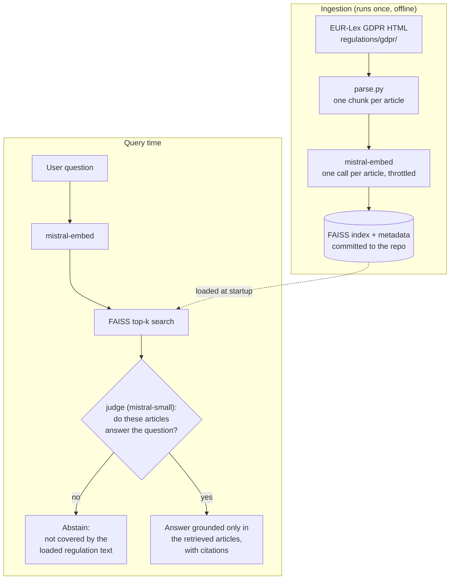

# Architecture

## Pipeline

## Why retrieve, judge, abstain, cite, not a single call

Generation always produces text, whether or not the retrieved articles
answer the question. The judge checks sufficiency first, in a separate
model call. If the articles do not support an answer, the tool abstains
before anything is written.

## Prompt-injection separation

Retrieved article text is rendered into clearly delimited `<article>` blocks
and only ever placed in the *user* turn, never the system role. See
`delimit_articles()` in `rag.py`. The system prompt instructs the model to
treat that content as reference data, not instructions. Risk is low for
statute text, but the architecture is regulation-agnostic (see below), and a
future regulation source could be arbitrary documents.

## Regulation-agnostic by design

Nothing in `rag.py` hard-codes "GDPR". Regulation names come from
`config.json`, and every chunk carries its regulation id. Adding another
regulation (ePrivacy, DSA, NIS2, the AI Act) means: drop the source file in
`regulations/<reg>/`, add a config entry, re-run `ingest.py`. The core loop
does not change.

`check_cross_regulation_interplay()` in `rag.py` is a deliberate no-op stub
for when two loaded regulations both cover a question (GDPR and ePrivacy on
cookie consent). With one regulation loaded it cannot be tested, so it stays
a documented placeholder. See its docstring.

## Deployment

Single stateless container (`Dockerfile`): the FAISS index and regulation
text are baked into the image at build time, so there's no runtime ingestion
step and no persistent volume. The app binds to the host's injected `$PORT`.
Secrets (`MISTRAL_API_KEY`, `DEMO_USER`, `DEMO_PASS`) are supplied as
environment variables by the host, never committed.
