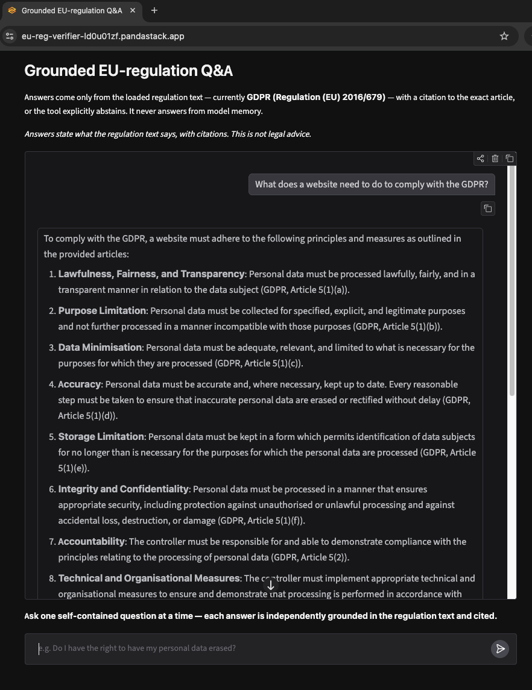

# Grounded EU-Regulation Q&A

Ask a question about the GDPR and get a straight answer tied to the exact article
it comes from — or a clear "the text doesn't cover that." Every answer is drawn
from the regulation itself and shows its source, so you can trust it and check it
in seconds.

**[Live demo](https://eu-reg-verifier-ld0u01zf.pandastack.app)** *(free hosting — first load takes ~30s)*



## Why it's useful

- **Answers you can verify.** Each answer cites the exact article and shows the
  source text — no black-box paraphrasing.
- **It won't bluff.** When the regulation doesn't address your question, it says so
  instead of inventing an answer.
- **Straight from the source.** Responses come only from the regulation text, not
  from a model's training data.
- **Transparent by design.** The retrieve → judge → cite pipeline is hand-built and
  easy to follow end to end.

## How it works

- `ingest.py` splits the GDPR into one chunk per article, embeds each with
  `mistral-embed`, and builds a FAISS index (committed, so the app loads instantly
  and never rebuilds at runtime).
- `rag.py` embeds your question, retrieves the most relevant articles, checks with
  `mistral-small` whether they actually answer it, then either answers grounded in
  those articles with citations, or abstains. Retrieved text is handled as
  reference data, never as instructions.
- `app.py` is a Gradio chat UI; each question is answered on its own, so every
  answer stands alone and can be checked.

## Run locally

```
python -m venv .venv && source .venv/bin/activate
pip install -r requirements.txt
echo "MISTRAL_API_KEY=your_key_here" > .env      # add DEMO_USER / DEMO_PASS to enable login
python app.py                                    # index is committed; no ingest needed
```

Rebuild the index from source: `python ingest.py`.

Or run it containerized:
```
docker build -t eu-reg-verifier .
docker run -p 7860:7860 --env-file .env eu-reg-verifier
```

## Source & attribution

Contains the text of Regulation (EU) 2016/679 (GDPR), consolidated version, from
EUR-Lex © European Union, reused under Commission Decision 2011/833/EU / CC BY 4.0.
Text has been segmented (chunked) for retrieval; meaning unaltered.

Only the Official Journal of the European Union (electronic edition, on EUR-Lex) is
authentic and produces legal effects. This tool answers what the regulation text
says, with citations — it is not legal advice.

## Good to know

- It answers from the GDPR. Topics an online business often bundles with it —
  cookie banners, marketing consent — are governed by neighbouring regulations like
  ePrivacy, so treat cross-regulation questions with care.
- It reads the articles of the regulation; points developed mainly in the recitals
  are flagged rather than assumed.
- Grounding in the source text sharply cuts made-up answers, though no retrieval
  system removes them entirely.

## Built to grow

An online business rarely faces just one regulation. The engine is corpus-agnostic
— the same grounded, cited, no-bluffing approach extends to ePrivacy, the DSA, NIS2
and the AI Act by adding text and config, not by rewriting.

## More

- [ARCHITECTURE.md](ARCHITECTURE.md) — the full pipeline, why the judge step exists,
  and how the corpus-agnostic design works.
- [EVALUATION.md](EVALUATION.md) — real results from a 9-question test set, including
  the one known limitation it surfaced.
